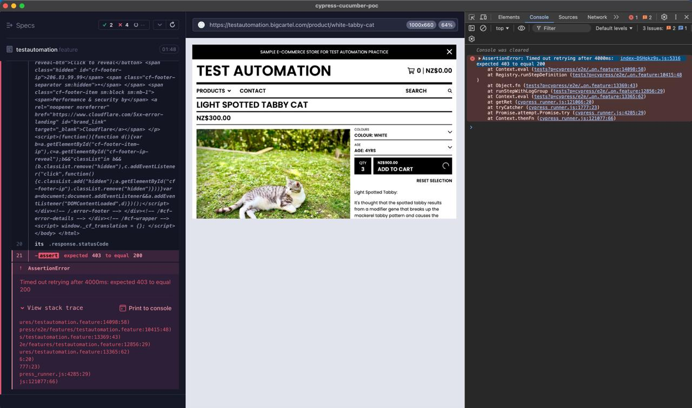

# Cypress Cucumber POC

> A proof-of-concept project to showcase the implementation of [Cypress](https://www.cypress.io/) as a test framework with [Cucumber BDD](https://cucumber.io/) and [Mochawesome reporter](https://www.npmjs.com/package/cypress-mochawesome-reporter) integration to test the checkout flow for the ["Test Automation - Big Cartel E-commerce Test Store"](https://testautomation.bigcartel.com/).

---
### Table of contents

- [Overview](#overview)
- [Test Scenarios](#test-scenarios)
- [Pre requisites](#prerequisites)
- [Setup](#setup)
- [Running tests](#running-tests)
- [Viewing test results](#viewing-test-results)
- [CI/CD Pipeline](#cicd-pipeline)
- [Additional notes](#additional-notes)
- [Gotcha's](#gotchas)
- [Unresolved issues - Work in progress and being monitored](#unresolved-issues---work-in-progress-and-being-monitored)
  - [1. Firefox runner fails to capture the video recording](#1-firefox-runner-fails-to-capture-the-video-recording)
  - [2. Test scenarios, steps previously disabled and temporary scenarios added to handle Cloudflare security checks triggered on cart and checkout pages:](#2-test-scenario-steps-disabled-and-temporary-steps-added-to-handle-cloudflare-security-checks-triggered-on-add-to-cart-cart-page-and-checkout-page)
    - [2.1. New Scenarios created when a product is added to cart](#21-new-scenarios-created-when-a-product-is-added-to-cart)
    - [2.2. Previously working scenarios disabled where a product is added to cart ➝ continuing to cart ➝ verifying cart details ➝ and continuing to the checkout](#22-previously-working-scenarios-disabled-where-a-product-is-added-to-cart--continuing-to-cart--verifying-cart-details--and-continuing-to-the-checkout)

---

### Overview

This repository demonstrates:

- **Cypress Testing Framework**: Utilises [Cypress Studio](https://docs.cypress.io/app/guides/cypress-studio) for test recording - [follow this guide to record test steps with Cypress Studio](https://docs.cypress.io/app/guides/cypress-studio#Step-1---Run-the-spec).
- **Cucumber BDD**: Implemented Behaviour-Driven Development for structured, readable test scenarios.
- **Mochawesome Reporter**: Generates detailed test result reports.
- **Local Execution**: Run tests locally with multiple browser options.
- **CI/CD Integration**: Executes tests in a [Docker container](https://www.docker.com/) via [GitHub Actions](https://github.com/badj/cypress-cucumber-poc/actions), triggered on push/pull requests to the main branch and daily scheduled runs.

[_⇡ Return to the Table of Contents_](#table-of-contents)

---

### Test Scenarios

This project includes Cypress feature tests covering the following e-commerce checkout journeys:

- Contact page: Submit a contact enquiry ➝ triggers recaptcha.
- Search for an item in the store.
- View a product from search results.
- Select colour and age options from dropdowns.
- Increase item quantity.
- Proceed to the cart.
- Verify cart details, including:
  - Correct items.
  - Selected options.
  - Quantities.
  - Item prices and cart totals.

[_⇡ Return to the Table of Contents_](#table-of-contents)

---

### Prerequisites

Ensure the following is installed:

1. [Node.js](https://nodejs.org/en/download/) (LTS version recommended)
2. [npm](https://docs.npmjs.com/downloading-and-installing-node-js-and-npm/) (Included with Node.js)

[_⇡ Return to the Table of Contents_](#table-of-contents)

---
### Setup

1. Clone or Download:
   - Clone this repository: `git clone https://github.com/badj/cypress-cucumber-poc.git`
   - Alternatively, download the ZIP file and extract it.
2. Navigate to Project Directory:
   ```bash
   cd cypress-cucumber-poc
   ```
3. Install Dependencies:
   ```bash
   npm install
   ```

[_⇡ Return to the Table of Contents_](#table-of-contents)

---

### Running Tests

1. With the Cypress Test Runner:

- For an interactive GUI to select and run specific tests.
  ```bash
  npx cypress open
  ```
2. Headless Mode:
- Run tests without opening a browser window *(Default Electron Browser)*
  ```bash
  npx cypress run
  ```
3. Headed Mode - No exit - Alternative Browsers: (Electron/Chrome/Firefox/Edge/Webkit)
- Run tests with the browser open, and the browser remains open when the run completed 
  ```bash
  npx cypress run --headed --browser electron --no-exit
  ```
  ```bash
  npx cypress run --headed --browser chrome --no-exit
  ```
  ```bash
  npx cypress run --headed --browser firefox --no-exit
  ```
  ```bash
  npx cypress run --headed --browser edge --no-exit
  ```
  ```bash
  npx cypress run --headed --browser webkit --no-exit
  ```
4. Headless Mode - Alternative Browsers: (Electron/Chrome/Firefox/Edge/Webkit)
- Run tests with no browser window opening
  ```bash
  npx cypress run --browser electron
  ```
  ```bash
  npx cypress run --browser chrome
  ```
  ```bash
  npx cypress run --browser firefox
  ```
  ```bash
  npx cypress run --browser edge
  ```
  ```bash
  npx cypress run --browser webkit
  ```  
5. Headed Mode - Alternative Browsers: (Electron/Chrome/Firefox/Edge/Webkit)
- Run tests with the browser open and closing the browser when the run completed
  ```bash
  npx cypress run --headed
  ```
  ```bash
  npx cypress run --headed --browser chrome
  ```
  ```bash
  npx cypress run --headed --browser firefox
  ```
  ```bash
  npx cypress run --headed --browser edge
  ```
  ```bash
  npx cypress run --headed --browser webkit
  ```

[_⇡ Return to the Table of Contents_](#table-of-contents)

---

### Viewing Test Results

After the test run completes:

- **HTML Report:** Generated at [cypress/reports/html/](cypress/reports/html/) as `cypress-cucumber-poc-results.html`
    - To open the report automatically after a headless run:
  ```bash
   npx cypress run --reporter-options autoOpen=true
  ```
    - To always open the report after a run - set autoOpen to true in the Reporter Option in [cypress.config.js](cypress.config.js):
   ```javascript
   reporterOptions: {
        autoOpen: true
     }
   ```
- **Video Recordings:** Available at [cypress/reports/html/videos/](cypress/reports/html/videos/) and [cypress/videos/](cypress/videos/)
- **Screenshots:** Saved at [cypress/reports/screenshots/](cypress/reports/screenshots/) for test steps configured to capture screenshots.

[_⇡ Return to the Table of Contents_](#table-of-contents)

---

### CI/CD Pipeline

- [](https://github.com/badj/cypress-cucumber-poc/actions/workflows/main.yml)
  - Tests are executed in a Docker container using GitHub Actions.
  - Triggers on push/pull requests to the main branch and for daily scheduled runs. See the workflow configuration in [.github/workflows/main.yml](.github/workflows/main.yml).

[_⇡ Return to the Table of Contents_](#table-of-contents)

---

### Additional Notes

- Ensure all prerequisites are met before running tests.
- For issues or contributions, refer to the GitHub repository.

[_⇡ Return to the Table of Contents_](#table-of-contents)

---

### Gotcha's

**1. Installing Cypress dependencies using `npm install` failing due to an unsupported Node.js version**

> Your current Node.js version is older than the recommended LTS version.
> Cypress requires a more recent version of Node.js. As of Cypress 14.0.0, the minimum supported Node.js version is typically Node.js 18 or higher.

**To resolve the issue:**

1. Update Node.js using nvm (Node Version Manager) - Install Node.js 18 (LTS) or a newer version like 20
```bash
  nvm install 18
```
2. Switch to the new version
```bash
  nvm use 18
```
3. Set it as the default version
```bash
  nvm alias default 18
```
4. Verify the Node.js version - Ensure it’s at least v16 or higher.
```bash
  node -v
```
5. Verify npm version:
```bash
  npm -v
```

**Additional steps if the steps above do not resolve it:**

6. Clear npm Cache and Reinstall Dependencies → The error may be caused by a corrupted npm cache or incomplete dependency installation 
> This ensures a clean slate for dependency installation, avoiding issues from cached or corrupted files.
```bash
  npm cache clean --force
```
7. Remove the node_modules directory and package-lock.json → Navigate to the project directory 
> Change to the cypress-cucumber-poc project directory (example for macOS)*:
```bash
  cd [path to your repo]/cypress-cucumber-poc
```
8. Remove the node_modules directory and package-lock.json file:
```bash
  rm -rf node_modules package-lock.json
```
9. Reinstall dependencies:
```bash
  npm install
```

[_⇡ Return to the Table of Contents_](#table-of-contents)

---

### Unresolved issues - Work in progress and being monitored

#### 1. Firefox runner fails to capture the video recording

<details>
  <summary>Details</summary>

- **Status:** Investigating
- **Affected Browsers:** Firefox
- **Severity:** Low
- **Impact:** Video from the test run is not embedded in the test results report due to failed video capture during the Firefox test run.
- **Additional Details:** 
  - Test run succeeds but is unable to generate/process the video recording(s).
  - The following error is printed in the console at the end of the test run, during video recording processing: 

```javascript
Warning: We failed capturing this video.
This error will not affect or change the exit code.
Error: Insufficient frames captured to create video.
at ChildProcess.<anonymous> (<embedded>:1012:16262)
at ChildProcess.emit (node:events:518:28)
at ChildProcess._handle.onexit (node:internal/child_process:293:12)
```
</details>

---

#### 2. Test scenario steps disabled and temporary steps added to handle Cloudflare security checks triggered on add to cart, cart page and checkout page:

> - Will monitor the Cloudflare security checks that are triggered on the "add to cart" api call, cart page and checkout page loads.
> - Issue started on **18 February 2026**.
>   - Work around test steps were created that didn't verify cart page and checkout pages thoroughly.
>   - Unfortunately, the issues regressed further impacting the "add to cart" API calls from **3 March 2026**.
>   - Test journeys are now disabled for the affected pages/flows.

##### 2.1. New Scenarios created when a product is added to cart

<details>
  <summary>Details</summary>

- **Status:** Investigating/WIP
- **Affected Browsers:** ALL
- **Severity:** Medium
- **Impact:** Adding to Cart, viewing cart and continuing the checkout flow pages are triggering Cloudflare security check on api request level and page loads / redirects.
- **Additional Details:**
    - New test steps created to handle Cloudflare security checks triggered when adding to Cart

> **Scenarios updated with new steps due to Cloudflare security check triggered:**
> - ⚠️ Previously working steps disabled — issue started on **18 February 2026** and regressed to affect the add to cart API call on **3 March 2026**.
> - Tests are now checking for a 403 error response when adding to the cart for the "add to cart" API request/call.
> - Updated scenarios with new steps that are sampled below.

```javascript
  Scenario: Choose options on the product page ➝ add to the cart ➝ triggers a cloudflare security check that return a 403 response
    Given I am on the product page for "White-tabby-cat"
    When I select the color "Colour: White"
    And I select the age "Age: 4YRS"
    And I increase the quantity to 3
    Then adding it to the cart triggers a cloudflare security check that return a 403 response

  Scenario Outline: Choose options on the product page ➝ add to the cart ➝ triggers a cloudflare security check that return a 403 response
    Given I am on the product page for <Product>
    When <Product> with <color> with <age> and <quantity> is added to the cart with Cloudflare security enabled
    Then a cloudflare security check is triggered returning a 403 response
    Examples:
    | Product           | color           | age         | quantity |
    | "White-tabby-cat" | "Colour: White" | "Age: 4YRS" | 3        |

  Scenario: Add item to cart ➝ add to the cart ➝ triggers a cloudflare security check that return a 403 response
    Given I am on the product page for "White-tabby-cat"
    When product "White-tabby-cat" with color "Colour: White" with age "Age: 4YRS" and quantity 3 is added to the cart with Cloudflare security enabled
    Then a cloudflare security check is triggered returning a 403 response

  Scenario Outline: Add item to cart ➝ triggers a cloudflare security check that return a 403 response
    Given I am on the product page for <Product>
    When <Product> with <color> with <age> and <quantity> is added to the cart with Cloudflare security enabled
    Then a cloudflare security check is triggered returning a 403 response
    Examples:
    | Product           | color           | age         | quantity |
    | "White-tabby-cat" | "Colour: White" | "Age: 4YRS" | 3        |
```

**Cloudflare security check sample during "add to cart" API call that returns a 403 response:**


</details>

---

##### 2.2. Previously working scenarios disabled where a product is added to cart ➝ continuing to cart ➝ verifying cart details ➝ and continuing to the checkout

<details>
  <summary>Details</summary>

- **Status:** Investigating/WIP
- **Affected Browsers:** ALL
- **Severity:** Medium
- **Impact:** Adding to Cart, viewing cart and continuing the checkout flow pages are triggering Cloudflare security check on api request level and page loads / redirects.
- **Additional Details:**
    - New test steps created to handle Cloudflare security checks triggered when adding to Cart

> **Scenarios and steps disabled that are failing due to Cloudflare security checks triggered:**
> - Previously working steps disabled — issue started on **18 February 2026** and regressed affecting "add to cart" API call on **3 March 2026**.
> - ⚠️ Disabled all failing scenarios 
> - New scenarios and steps were created _(as noted above)_.
> - Disabled scenarios are sampled below.

```javascript
  Scenario: Choose options on the product page ➝ add to the cart
    Given I am on the product page for "White-tabby-cat"
    When I select the color "Colour: White"
    And I select the age "Age: 4YRS"
    And I increase the quantity to 3
    And I add it to the cart
    Then the selected color should be "Colour: White"
    And the selected age should be "Age: 4YRS"
    And the quantity should be 3
    And the cart total should be 'NZ$900.00'
    And the cart total items count should be 3

  Scenario Outline: Choose options on the product page ➝ add to the cart
    Given I am on the product page for <Product>
    When I select the color <color>
    And I select the age <age>
    And I increase the quantity to <quantity>
    And I add it to the cart
    Then the selected color should be <color>
    And the selected age should be <age>
    And the quantity should be <quantity>
    And the cart total should be <cartTotal>
    And the cart total items count should be <quantity>
    Examples:
      | Product           | color           | age         | quantity | cartTotal   |
      | "White-tabby-cat" | "Colour: White" | "Age: 4YRS" | 3        | 'NZ$900.00' |

  Scenario: Add item to cart ➝ continue to cart ➝ verify cart details ➝ continue the checkout 
    Given I am on the product page for "White-tabby-cat"
    And product "White-tabby-cat" with color "Colour: White" with age "Age: 4YRS" and quantity 3 is added to the cart
    When I proceed to the cart
    Then the cart page should contain the product details: "Light Spotted Tabby Cat", "Colour: White", "Age: 4YRS", 3, 'NZ$300.00' with sub total 'NZ$900.00'
    When I continue to the checkout
    Then The checkout proceeds to the checkout page

  Scenario: Add item to cart ➝ continue to cart ➝ cloudflare security check page is triggered
    Given I am on the product page for "White-tabby-cat"
    And product "White-tabby-cat" with color "Colour: White" with age "Age: 4YRS" and quantity 3 is added to the cart
    When I proceed to the cart a cloudflare security check page is triggered

  Scenario Outline: Add item to cart ➝ continue to cart ➝ verify cart details ➝ continue the checkout
    Given I am on the product page for <Product>
    And <Product> with <color> with <age> and <quantity> is added to the cart
    When I proceed to the cart
    Then the cart page should contain the product details: <itemName>, <color>, <age>, <quantity>, <itemPrice> with sub total <subTotal>
    And the cart page should contain page elements to continue shopping, provide the sub total and to continue the checkout
    When I continue to the checkout
    Then The checkout proceeds to the checkout page
    Examples:
      | Product           | color           | age         | quantity | itemName                  | itemPrice   | subTotal    |
      | "White-tabby-cat" | "Colour: White" | "Age: 4YRS" | 3        | "Light Spotted Tabby Cat" | 'NZ$300.00' | 'NZ$900.00' |

  Scenario Outline: Add item to cart ➝ continue to cart ➝ cloudflare security check page is triggered
    Given I am on the product page for <Product>
    And <Product> with <color> with <age> and <quantity> is added to the cart
    When I proceed to the cart a cloudflare security check page is triggered
    Examples:
      | Product           | color           | age         | quantity |
      | "White-tabby-cat" | "Colour: White" | "Age: 4YRS" | 3        |
```

**Test runner log output of test failures as a result of the "add to cart" API call that returns a 403 response when the Cloudflare security check is triggered:**

```javascript
Running:  testautomation.feature                                                          (1 of 1)

Cypress Test POC ➝ Contact and Checkout flow
2026-03-03 13:51:10.822 Cypress[92806:8464345] NSSpellServer dataFromGeneratingCandidatesForSelectedRange timed out, index is 0
✓ Submit a contact enquiry ➝ triggers recaptcha (example #1) (22613ms)
✓ Search for an item ➝ view the product (13227ms)
1) Choose options on the product page ➝ add to the cart
2) Choose options on the product page ➝ add to the cart (example #1)
3) Add item to cart ➝ continue to cart ➝ verify cart details ➝ continue the checkout
4) Add item to cart ➝ continue to cart ➝ verify cart details ➝ continue the checkout (example #1)

2 passing (2m)
4 failing

1) Cypress Test POC ➝ Contact and Checkout flow
   Choose options on the product page ➝ add to the cart:

   Timed out retrying after 4000ms
    + expected - actual

   -403
   +200

   at Context.eval (https://testautomation.bigcartel.com/__cypress/tests?p=cypress/e2e/features/testautomation.feature:13994:58)
   at Registry.runStepDefinition (https://testautomation.bigcartel.com/__cypress/tests?p=cypress/e2e/features/testautomation.feature:10415:48)
   at Object.fn (https://testautomation.bigcartel.com/__cypress/tests?p=cypress/e2e/features/testautomation.feature:13369:43)
   at runStepWithLogGroup (https://testautomation.bigcartel.com/__cypress/tests?p=cypress/e2e/features/testautomation.feature:12856:29)
   at Context.eval (https://testautomation.bigcartel.com/__cypress/tests?p=cypress/e2e/features/testautomation.feature:13365:62)
   at getRet (https://testautomation.bigcartel.com/__cypress/runner/cypress_runner.js:121066:20)
   at tryCatcher (https://testautomation.bigcartel.com/__cypress/runner/cypress_runner.js:1777:23)
   at Promise.attempt.Promise.try (https://testautomation.bigcartel.com/__cypress/runner/cypress_runner.js:4285:29)
   at Context.thenFn (https://testautomation.bigcartel.com/__cypress/runner/cypress_runner.js:121077:66)

2) Cypress Test POC ➝ Contact and Checkout flow
   Choose options on the product page ➝ add to the cart (example #1):

   Timed out retrying after 4000ms
    + expected - actual

   -403
   +200

   at Context.eval (https://testautomation.bigcartel.com/__cypress/tests?p=cypress/e2e/features/testautomation.feature:13994:58)
   at Registry.runStepDefinition (https://testautomation.bigcartel.com/__cypress/tests?p=cypress/e2e/features/testautomation.feature:10415:48)
   at Object.fn (https://testautomation.bigcartel.com/__cypress/tests?p=cypress/e2e/features/testautomation.feature:13369:43)
   at runStepWithLogGroup (https://testautomation.bigcartel.com/__cypress/tests?p=cypress/e2e/features/testautomation.feature:12856:29)
   at Context.eval (https://testautomation.bigcartel.com/__cypress/tests?p=cypress/e2e/features/testautomation.feature:13365:62)
   at getRet (https://testautomation.bigcartel.com/__cypress/runner/cypress_runner.js:121066:20)
   at tryCatcher (https://testautomation.bigcartel.com/__cypress/runner/cypress_runner.js:1777:23)
   at Promise.attempt.Promise.try (https://testautomation.bigcartel.com/__cypress/runner/cypress_runner.js:4285:29)
   at Context.thenFn (https://testautomation.bigcartel.com/__cypress/runner/cypress_runner.js:121077:66)

3) Cypress Test POC ➝ Contact and Checkout flow
   Add item to cart ➝ continue to cart ➝ verify cart details ➝ continue the checkout:

   Timed out retrying after 4000ms
    + expected - actual

   -403
   +200

   at Context.eval (https://testautomation.bigcartel.com/__cypress/tests?p=cypress/e2e/features/testautomation.feature:14080:58)
   at Registry.runStepDefinition (https://testautomation.bigcartel.com/__cypress/tests?p=cypress/e2e/features/testautomation.feature:10415:48)
   at Object.fn (https://testautomation.bigcartel.com/__cypress/tests?p=cypress/e2e/features/testautomation.feature:13369:43)
   at runStepWithLogGroup (https://testautomation.bigcartel.com/__cypress/tests?p=cypress/e2e/features/testautomation.feature:12856:29)
   at Context.eval (https://testautomation.bigcartel.com/__cypress/tests?p=cypress/e2e/features/testautomation.feature:13365:62)
   at getRet (https://testautomation.bigcartel.com/__cypress/runner/cypress_runner.js:121066:20)
   at tryCatcher (https://testautomation.bigcartel.com/__cypress/runner/cypress_runner.js:1777:23)
   at Promise.attempt.Promise.try (https://testautomation.bigcartel.com/__cypress/runner/cypress_runner.js:4285:29)
   at Context.thenFn (https://testautomation.bigcartel.com/__cypress/runner/cypress_runner.js:121077:66)

4) Cypress Test POC ➝ Contact and Checkout flow
   Add item to cart ➝ continue to cart ➝ verify cart details ➝ continue the checkout (example #1):

   Timed out retrying after 4000ms
    + expected - actual

   -403
   +200

   at Context.eval (https://testautomation.bigcartel.com/__cypress/tests?p=cypress/e2e/features/testautomation.feature:14098:58)
   at Registry.runStepDefinition (https://testautomation.bigcartel.com/__cypress/tests?p=cypress/e2e/features/testautomation.feature:10415:48)
   at Object.fn (https://testautomation.bigcartel.com/__cypress/tests?p=cypress/e2e/features/testautomation.feature:13369:43)
   at runStepWithLogGroup (https://testautomation.bigcartel.com/__cypress/tests?p=cypress/e2e/features/testautomation.feature:12856:29)
   at Context.eval (https://testautomation.bigcartel.com/__cypress/tests?p=cypress/e2e/features/testautomation.feature:13365:62)
   at getRet (https://testautomation.bigcartel.com/__cypress/runner/cypress_runner.js:121066:20)
   at tryCatcher (https://testautomation.bigcartel.com/__cypress/runner/cypress_runner.js:1777:23)
   at Promise.attempt.Promise.try (https://testautomation.bigcartel.com/__cypress/runner/cypress_runner.js:4285:29)
   at Context.thenFn (https://testautomation.bigcartel.com/__cypress/runner/cypress_runner.js:121077:66)
```
</details>

[_⇡ Return to the Table of Contents_](#table-of-contents)

---


 
